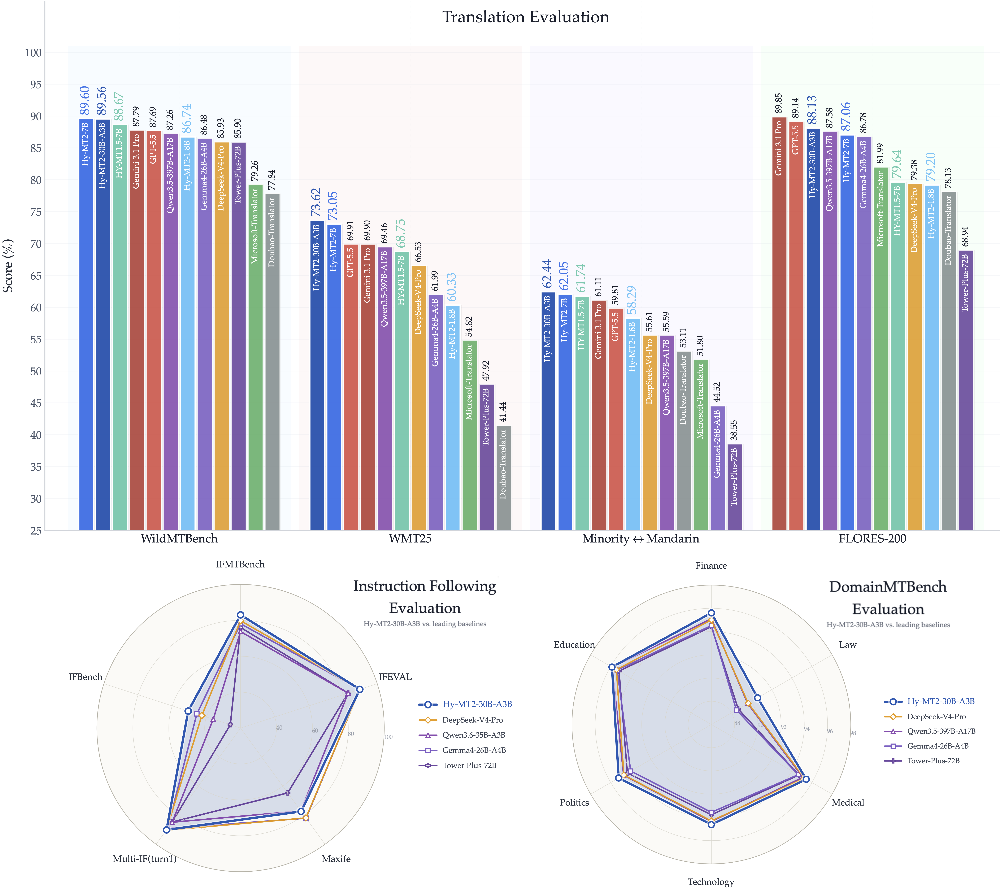

<p align="left">
   English&nbsp;｜&nbsp;<a href="README_CN.md">中文</a>
</p>
<br>

<p align="center">
  <br> 
</p>

<div align="center" style="line-height: 1;">


[](https://huggingface.co/collections/tencent/hy-mt2)
&nbsp;&nbsp;
[](https://modelscope.cn/collections/Tencent-Hunyuan/Hy-MT2)

</div>

<p align="center">
    🖥️&nbsp;<a href="https://aistudio.tencent.com/"><b>Official Website</b></a>&nbsp;&nbsp;|&nbsp;&nbsp;
    💬&nbsp;<a href="https://github.com/Tencent-Hunyuan/Hy-MT2"><b>GitHub</b></a>&nbsp;&nbsp;|&nbsp;&nbsp;
    🪡&nbsp;<a href="https://github.com/Tencent/AngelSlim/tree/main"><b>AngelSlim</b></a></p>

## Model Introduction


**Hy-MT2** is a multilingual machine translation model series covering both Dense and MoE architectures. It includes three fast-thinking models: **Hy-MT2-1.8B, 7B, and 30B-A3B**. The series supports translation among 33 languages and 5 ethnic minority languages / Chinese dialects, as well as multilingual instruction following. The series also provides **1.25-bit extreme quantized versions** based on AngelSlim. Among them, the 1.8B model requires only 440 MB of storage and runs 1.5x faster than traditional 4-bit inference on the Apple A15 chip.

Evaluation results show that Hy-MT2 performs strongly across multiple scenarios:

* **General Translation (FLORES-200)**: The average performance of the three models reaches 89.9%, 97.9%, and 98.6% of **Gemini 3.1 Pro (Think)**, respectively. Among them, the 7B and A3B models outperform **DeepSeek-V4-Pro**, while the 1.8B model achieves better overall performance than commercial APIs such as Microsoft Translator.
* **Real-World Scenarios and Professional Domains (WildMTBench/DomainMTBench)**: The GEMBA scores of the three models reach more than 96%–99% of Gemini 3.1 Pro (Think), and all of them outperform larger open-source models.
* **Translation Instruction Following (IFMTBench)**: The models significantly outperform open-source models of the same scale, while the A3B model approaches the performance of Gemini 3.1 Pro (Think).

In summary, Hy-MT2 is an efficient and powerful translation model series designed for complex real-world scenarios.

In this release, we also open-source [IFMTBench](./IFMTBench/README.md), a benchmark for evaluating translation instruction-following capabilities.

We also welcome everyone to use our released Hy-MT2-Translator Skill, which makes it easy to integrate Hy-MT2 series models for translation tasks. Download links: [ClawHub](https://clawhub.ai/tencent-adm/hy-mt2-translator-skill) and [SkillHub](https://skillhub.cn/skills/hy-mt2-translator).

## News
<br>
* 2026.5.21  We open-sourced **Hy-MT2-1.8B**/**Hy-MT2-7B**/**Hy-MT2-30B-A3B** on HuggingFace and ModelScope.
* 2025.12.30 We open-sourced **HY-MT1.5-1.8B** and **HY-MT1.5-7B** on HuggingFace and ModelScope.
* 2025.9.1 We open-sourced **Hunyuan-MT-7B** and **Hunyuan-MT-Chimera-7B** on HuggingFace and ModelScope.


## Results
<div align='center'>

</div>

For more experimental results and analysis, please refer to our [technical report](./HY_MT2_0_Technical_Report.pdf).

&nbsp;

## Model Links
| Model Name  | Description | Download Link |
| ----------- | ----------- |-----------
| Hy-MT2-1.8B  | Hunyuan 1.8B translation model |🤗 [Model](https://huggingface.co/tencent/Hy-MT2-1.8B)|
| Hy-MT2-1.8B-FP8 | Hunyuan 1.8B translation model, FP8 quantization    | 🤗 [Model](https://huggingface.co/tencent/Hy-MT2-1.8B-FP8)|
| Hy-MT2-1.8B-GGUF | Hunyuan 1.8B translation model, llama.cpp    | 🤗 [Model](https://huggingface.co/tencent/Hy-MT2-1.8B-GGUF)|
| Hy-MT2-7B | Hunyuan 7B translation model    | 🤗 [Model](https://huggingface.co/tencent/Hy-MT2-7B)|
| Hy-MT2-7B-FP8 | Hunyuan 7B translation model, FP8 quantization     | 🤗 [Model](https://huggingface.co/tencent/Hy-MT2-7B-FP8)|
| Hy-MT2-7B-GGUF | Hunyuan 7B translation model, llama.cpp    | 🤗 [Model](https://huggingface.co/tencent/Hy-MT2-7B-GGUF)|
| Hy-MT2-30B-A3B | Hunyuan 30B-A3B translation model    | 🤗 [Model](https://huggingface.co/tencent/Hy-MT2-30B-A3B)|
| Hy-MT2-30B-A3B-FP8 | Hunyuan 30B-A3B translation model, FP8 quantization     | 🤗 [Model](https://huggingface.co/tencent/Hy-MT2-30B-A3B-FP8)|


## Hy-MT2 Translation Task Instruction Examples (Chinese-English Comparison)

*Note: In the following examples, both source_lang and target_lang should use the full language names. Chinese names should be used in Chinese prompts, and English names should be used in English prompts.*

| Type | Chinese prompt | English prompt |
|---|---|---|
| **Default Translation** | 将以下文本翻译为 `{target_lang}`，注意**只需要输出翻译后的结果，不要额外解释**：<br><br>`{source_text}` | Translate the following text into `{target_lang}`. Note that you should **only output the translated result without any additional explanation**:<br><br>`{source_text}` |
| **Terminology** | *参考下面的翻译：*<br>`{text}` 翻译成 `{text}`<br>`{text}` 翻译成 `{text}`<br>`{text}` 翻译成 `{text}`<br>将以下文本翻译为 `{target_lang}`，注意**只需要输出翻译后的结果，不要额外解释**：<br><br>`{source_text}` | *Reference the following translations:*<br>`{text}` translates to `{text}`<br>`{text}` translates to `{text}`<br>`{text}` translates to `{text}`<br><br>Translate the following text into `{target_lang}`. Note that you must **ONLY output the translated result without any additional explanation**:<br><br>`{source_text}` |
| **Style** | 请将以下文本翻译为 `{target_lang}`。<br>注意翻译的风格要严格符合【**`{target_style}`**】<br><br>`{source_text}` | Please translate the following text into `{target_lang}`. Note that the translation style must strictly conform to [**`{target_style}`**]:<br><br>`{source_text}` |
| **Personalization** | *【待翻译文本】*<br>`{source_text}`<br><br>*【翻译任务】*<br>1、**`{user_preferences}`**<br>2、**`{user_preferences}`**<br>3、……<br>4、将【待翻译文本】翻译为 `{target_lang}`。 | *[Source Text]*<br>`{source_text}`<br><br>*[Translation Tasks]*<br>1. **`{user_preferences}`**<br>2. **`{user_preferences}`**<br>3. ...<br>4. Translate the [Source Text] into `{target_lang}`. |
| **Delimiters** | 请将以下文本准确翻译为 `{target_lang}`。<br>你必须在译文中**保留等量的分隔符，绝对不可遗漏、转义或翻译该符号，并注意分隔符的位置**。<br><br>`{source_text}` | Please accurately translate the following text into `{target_lang}`.<br>You must **retain the exact same number of delimiters in the translation. Strictly do not omit, escape, or translate these symbols, and pay close attention to their placement**.<br><br>`{source_text}` |
| **Structured Data 1** | *# 任务目标*<br>将下方 `{source_text}` 中的 `{format_type}` 格式数据翻译为 `{target_lang}`。<br><br>*# 严格约束*<br>1. **结构锁定**：绝对保持原有的 `{format_type}` 数据结构、缩进和层级完全不变。<br>2. **选择性翻译**：仅翻译面向用户展示的可见文本内容。<br>3. **禁止修改**：**严禁**翻译或更改任何代码标签、键名 (Key)、变量占位符（如 `{{var}}`、`${var}`、`%s`、`%d` 等）或代码属性。<br><br>*# 数据输入*<br>`{source_text}` | *### Task*<br>Translate the user-facing text within the following `{format_type}` data into `{target_lang}`.<br><br>*### Strict Rules*<br>1. **Structure Preservation:** You MUST preserve the original `{format_type}` data structure, nesting, hierarchy, and indentation exactly as they are.<br>2. **Selective Translation:** Translate ONLY the visible, user-facing text content/values.<br>3. **Strict Non-Translation:** NEVER translate or alter code tags, keys, properties, object names, or variable placeholders. Leave them exactly in their original English/code form.<br><br>*### Source Data*<br>`{source_text}` |
| **Structured Data 2** | *【背景信息】*<br>`{background_text}`<br><br>请结合背景信息将以下文本翻译为 `{target_lang}`。<br><br>*【待翻译文本】*<br>`{source_text}` | *[Background Information]*<br>`{background_text}`<br><br>Please translate the following text into `{target_lang}`, taking the provided background information into consideration.<br><br>*[Source Text]*<br>`{source_text}` |

---

## Inference and Deployment
### transformers

transformers>=5.6.0

```python
from transformers import AutoModelForCausalLM, AutoTokenizer
import torch

model_path = "tencent/Hy-MT2-30B-A3B"

# Load tokenizer
tokenizer = AutoTokenizer.from_pretrained(model_path, trust_remote_code=True)

# Load model
model = AutoModelForCausalLM.from_pretrained(
    model_path,
    dtype=torch.bfloat16,
    device_map="auto",
    trust_remote_code=True,
)

model.eval()

# Example inference
prompt = "将以下文本翻译成英语,注意只需要输出翻译后的结果,不要额外解释:\n\n今天天气真好。"
messages = [{"role": "user", "content": prompt}]
inputs = tokenizer.apply_chat_template(messages, add_generation_prompt=True, return_tensors="pt").to(model.device)

with torch.no_grad():
    outputs = model.generate(
        **inputs,
        max_new_tokens=4096,
    )
response = tokenizer.decode(outputs[0][inputs["input_ids"].shape[-1]:], skip_special_tokens=True)
print(response)
```

### vllm

Build vLLM from source:
```bash
uv venv --python 3.12 --seed --managed-python
source .venv/bin/activate
git clone https://github.com/vllm-project/vllm.git
cd vllm
uv pip install --editable . --torch-backend=auto
```

Start the vLLM server:

```bash
vllm serve tencent/Hy-MT2-30B-A3B --tensor-parallel-size 1
```

### sglang

Build SGLang from source:
```bash
git clone https://github.com/sgl-project/sglang
cd sglang
pip3 install pip --upgrade
pip3 install "transformers>=5.6.0"
pip3 install -e "python"
```

Launch SGLang server:

```bash
python3 -m sglang.launch_server --model tencent/Hy-MT2-30B-A3B --tp 1
```

### llama_cpp
**❕❕ This gguf depends on our STQ kernel, which is released at [PR #22836](https://github.com/ggml-org/llama.cpp/pull/22836).**

#### Clone llama.cpp

```bash
git clone https://github.com/ggml-org/llama.cpp.git
```

#### Enter the llama.cpp folder

```bash
cd llama.cpp
```

#### Build llama.cpp

```bash
cmake -B build
cmake --build build --config Release
```

#### Run a completion example

```bash
./build/bin/llama-completion \
  --model model.gguf  \
  -p "Translate the following segment into Chinese, without additional explanation：Hello" \
  --jinja \
  -ngl 0 \
  -n 64 -st 
```

#### Run the llama.cpp benchmark

```bash
./build/bin/llama-bench -m model_zoo/model.gguf  -ngl 0
```


For 1.8B and 7B, we recommend using the following parameters for inference. Note that our models do not have a default system_prompt.

```json

{
  "temperature": 0.7,
  "top_p": 0.6,
  "top_k": 20,
  "repetition_penalty": 1.05,
  "max_tokens": 4096
}
```

For 30B-A3B, we recommend using the following parameters for inference. Note that our models do not have a default system_prompt.

```json

{
  "temperature": 0.7,
  "top_p": 1.0,
  "top_k": -1,
  "repetition_penalty": 1.0,
  "max_tokens": 4096
}
```

## Model Training
Hy-MT2 provides a complete model training pipeline, supporting both full-parameter fine-tuning and LoRA fine-tuning, as well as multiple DeepSpeed ZeRO configurations and LLaMA-Factory integration.

For detailed training documentation, please refer to: [Model Training Guide](./train/README.md)

## Quantization Tool

We provide [AngelSlim](https://github.com/tencent/AngelSlim), an easy-to-use, comprehensive, and efficient large model compression toolkit covering common quantization algorithms, low-bit quantization, speculative sampling, and more.


## Supported Languages
| Languages         | Abbr.   | Chinese Names   |
|-------------------|---------|-----------------|
| Chinese           | zh      | 中文            |
| English           | en      | 英语            |
| French            | fr      | 法语            |
| Portuguese        | pt      | 葡萄牙语        |
| Spanish           | es      | 西班牙语        |
| Japanese          | ja      | 日语            |
| Turkish           | tr      | 土耳其语        |
| Russian           | ru      | 俄语            |
| Arabic            | ar      | 阿拉伯语        |
| Korean            | ko      | 韩语            |
| Thai              | th      | 泰语            |
| Italian           | it      | 意大利语        |
| German            | de      | 德语            |
| Vietnamese        | vi      | 越南语          |
| Malay             | ms      | 马来语          |
| Indonesian        | id      | 印尼语          |
| Filipino          | tl      | 菲律宾语        |
| Hindi             | hi      | 印地语          |
| Traditional Chinese | zh-Hant| 繁体中文        |
| Polish            | pl      | 波兰语          |
| Czech             | cs      | 捷克语          |
| Dutch             | nl      | 荷兰语          |
| Khmer             | km      | 高棉语          |
| Burmese           | my      | 缅甸语          |
| Persian           | fa      | 波斯语          |
| Gujarati          | gu      | 古吉拉特语      |
| Urdu              | ur      | 乌尔都语        |
| Telugu            | te      | 泰卢固语        |
| Marathi           | mr      | 马拉地语        |
| Hebrew            | he      | 希伯来语        |
| Bengali           | bn      | 孟加拉语        |
| Tamil             | ta      | 泰米尔语        |
| Ukrainian         | uk      | 乌克兰语        |
| Tibetan           | bo      | 藏语            |
| Kazakh            | kk      | 哈萨克语        |
| Mongolian         | mn      | 蒙古语          |
| Uyghur            | ug      | 维吾尔语        |
| Cantonese         | yue     | 粤语            |


## Citing Hy-MT2

```bibtex
@misc{hy-mt1.5,
      title={HY-MT1.5 Technical Report}, 
      author={Mao Zheng and Zheng Li and Tao Chen and Mingyang Song and Di Wang},
      year={2025},
      eprint={2512.24092},
      archivePrefix={arXiv},
      primaryClass={cs.CL},
      url={https://arxiv.org/abs/2512.24092}, 
}
```

## Contact Us
If you would like to leave feedback for our R&D and product teams, you are welcome to contact the Tencent Hunyuan LLM team. You can reach us by email at hunyuan_opensource@tencent.com.
